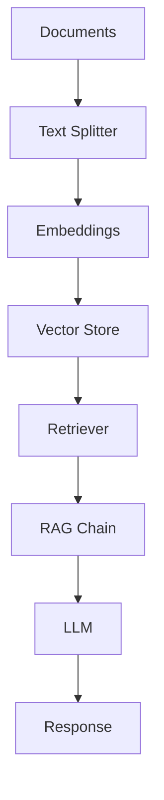

# Intégration Langchain - Documentation Complète

## 🚀 Vue d'ensemble

Cette documentation présente l'intégration complète de Langchain dans notre système RAG, basée sur les [meilleures pratiques officielles](https://python.langchain.com/docs/concepts/rag) et les exemples de la documentation Langchain.

## 📚 Architecture Langchain

### Composants principaux

```python
# Structure des composants Langchain
from langchain_core.documents import Document
from langchain_core.vectorstores import InMemoryVectorStore
from langchain_community.vectorstores import FAISS, Chroma
from langchain_openai import OpenAIEmbeddings
from langchain_mistralai import MistralAIEmbeddings
from langchain_cohere import CohereEmbeddings
```

### Flux RAG avec Langchain



## 🔧 Configuration

### 1. Embeddings

#### Mistral AI Embeddings
```python
from langchain_mistralai import MistralAIEmbeddings

embeddings = MistralAIEmbeddings(
    model="mistral-embed",
    api_key="your_mistral_api_key"
)
```

#### OpenAI Embeddings
```python
from langchain_openai import OpenAIEmbeddings

embeddings = OpenAIEmbeddings(
    model="text-embedding-3-small",
    api_key="your_openai_api_key"
)
```

#### Cohere Embeddings
```python
from langchain_cohere import CohereEmbeddings

embeddings = CohereEmbeddings(
    model="embed-english-v3.0",
    api_key="your_cohere_api_key"
)
```

### 2. Vector Stores

#### InMemoryVectorStore (Développement)
```python
from langchain_core.vectorstores import InMemoryVectorStore

vector_store = InMemoryVectorStore.from_texts(
    texts=["Document 1", "Document 2"],
    embedding=embeddings
)
```

#### FAISS (Production)
```python
from langchain_community.vectorstores import FAISS

vector_store = FAISS.from_documents(
    documents=documents,
    embedding=embeddings
)
```

#### Chroma (Persistant)
```python
from langchain_community.vectorstores import Chroma

vector_store = Chroma.from_documents(
    documents=documents,
    embedding=embeddings,
    persist_directory="./chroma_db"
)
```

#### Supabase (Cloud)
```python
from langchain_community.vectorstores import SupabaseVectorStore

vector_store = SupabaseVectorStore(
    embedding=embeddings,
    supabase_url="your_supabase_url",
    supabase_key="your_supabase_key",
    table_name="documents"
)
```

## 🔗 Chaînes RAG

### 1. Chaîne RAG Basique

```python
from langchain.chains import RetrievalQA
from langchain_openai import ChatOpenAI

# Initialiser le LLM
llm = ChatOpenAI(model="gpt-3.5-turbo", temperature=0)

# Créer la chaîne RAG
qa_chain = RetrievalQA.from_chain_type(
    llm=llm,
    chain_type="stuff",
    retriever=vector_store.as_retriever(),
    return_source_documents=True
)

# Utiliser la chaîne
result = qa_chain.invoke({"query": "Qu'est-ce que l'IA ?"})
print(result["result"])
```

### 2. Chaîne RAG Conversationnelle

```python
from langchain.chains import ConversationalRetrievalChain
from langchain.memory import ConversationBufferMemory

# Initialiser la mémoire
memory = ConversationBufferMemory(
    memory_key="chat_history",
    return_messages=True
)

# Créer la chaîne conversationnelle
conversational_chain = ConversationalRetrievalChain.from_llm(
    llm=llm,
    retriever=vector_store.as_retriever(),
    memory=memory,
    return_source_documents=True
)

# Utiliser la chaîne
result = conversational_chain({"question": "Expliquez l'IA"})
print(result["answer"])
```

### 3. Chaîne RAG avec Sources

```python
from langchain.chains import RetrievalQAWithSourcesChain

qa_with_sources_chain = RetrievalQAWithSourcesChain.from_chain_type(
    llm=llm,
    chain_type="stuff",
    retriever=vector_store.as_retriever()
)

result = qa_with_sources_chain({"question": "Qu'est-ce que l'IA ?"})
print(f"Réponse: {result['answer']}")
print(f"Sources: {result['sources']}")
```

## 🛠️ Exemples Avancés

### 1. RAG avec Reranking

```python
from langchain_cohere import CohereRerank

# Initialiser le reranker
reranker = CohereRerank(
    model="rerank-multilingual-v3.0",
    api_key="your_cohere_api_key",
    top_n=3
)

# Récupérer les documents
retriever = vector_store.as_retriever(search_kwargs={"k": 10})
documents = retriever.invoke("Qu'est-ce que l'IA ?")

# Reranker les documents
reranked_docs = reranker.compress_documents(documents, "Qu'est-ce que l'IA ?")

# Utiliser les documents rerankés
context = "\n".join([doc.page_content for doc in reranked_docs])
```

### 2. RAG avec Filtrage

```python
# Recherche avec filtres
filtered_docs = vector_store.similarity_search(
    "Qu'est-ce que l'IA ?",
    k=5,
    filter={"category": "technology"}
)
```

### 3. RAG avec Score de Similarité

```python
# Recherche avec scores
docs_with_scores = vector_store.similarity_search_with_score(
    "Qu'est-ce que l'IA ?",
    k=5
)

for doc, score in docs_with_scores:
    print(f"Score: {score:.3f} - {doc.page_content[:100]}...")
```

## 📊 Optimisation des Performances

### 1. Cache des Embeddings

```python
from langchain.cache import InMemoryCache
from langchain.globals import set_llm_cache

# Activer le cache
set_llm_cache(InMemoryCache())
```

### 2. Embeddings Cachés

```python
from langchain_community.embeddings import CacheBackedEmbeddings
from langchain.storage import LocalFileStore

# Créer un store local
store = LocalFileStore("./cache/")

# Créer des embeddings cachés
cached_embeddings = CacheBackedEmbeddings.from_bytes_store(
    embeddings,
    store,
    namespace=embeddings.model
)
```

### 3. Traitement par Lots

```python
# Traitement par lots pour les embeddings
def batch_embed_documents(documents, batch_size=100):
    embeddings_list = []
    for i in range(0, len(documents), batch_size):
        batch = documents[i:i + batch_size]
        batch_embeddings = embeddings.embed_documents([doc.page_content for doc in batch])
        embeddings_list.extend(batch_embeddings)
    return embeddings_list
```

## 🔍 Recherche Avancée

### 1. Recherche Hybride

```python
from langchain.retrievers import BM25Retriever
from langchain.retrievers import EnsembleRetriever

# Retriever vectoriel
vector_retriever = vector_store.as_retriever()

# Retriever BM25
bm25_retriever = BM25Retriever.from_documents(documents)
bm25_retriever.k = 5

# Retriever hybride
ensemble_retriever = EnsembleRetriever(
    retrievers=[vector_retriever, bm25_retriever],
    weights=[0.7, 0.3]
)
```

### 2. Recherche Multi-Vecteurs

```python
from langchain.retrievers import MultiVectorRetriever

# Créer plusieurs vector stores
vector_stores = [vector_store1, vector_store2, vector_store3]

# Retriever multi-vecteurs
multi_retriever = MultiVectorRetriever(vector_stores)
```

### 3. Recherche avec Métadonnées

```python
# Recherche avec métadonnées complexes
def search_with_metadata(query, filters):
    return vector_store.similarity_search(
        query,
        k=5,
        filter=filters
    )

# Exemple d'utilisation
results = search_with_metadata(
    "Qu'est-ce que l'IA ?",
    {
        "category": "technology",
        "language": "fr",
        "date": {"$gte": "2023-01-01"}
    }
)
```

## 🧪 Tests et Évaluation

### 1. Test de Récupération

```python
def test_retrieval_quality(query, expected_docs):
    results = vector_store.similarity_search(query, k=5)
    
    # Vérifier la pertinence
    relevant_docs = [doc for doc in results if doc.metadata.get("relevant", False)]
    
    precision = len(relevant_docs) / len(results)
    recall = len(relevant_docs) / len(expected_docs)
    
    return {"precision": precision, "recall": recall}
```

### 2. Test de Génération

```python
def test_generation_quality(question, context, expected_answer):
    # Créer un prompt avec le contexte
    prompt = f"""
    Contexte: {context}
    Question: {question}
    Réponse:
    """
    
    # Générer la réponse
    response = llm.invoke(prompt)
    
    # Évaluer la qualité (simplifié)
    return evaluate_response(response, expected_answer)
```

## 📈 Monitoring et Observabilité

### 1. Logging des Requêtes

```python
import logging

# Configurer le logging
logging.basicConfig(level=logging.INFO)
logger = logging.getLogger(__name__)

def log_rag_query(query, response, sources):
    logger.info(f"Query: {query}")
    logger.info(f"Response: {response}")
    logger.info(f"Sources: {len(sources)} documents")
```

### 2. Métriques de Performance

```python
import time
from typing import Dict, Any

def measure_rag_performance(query: str) -> Dict[str, Any]:
    start_time = time.time()
    
    # Récupération
    retrieval_start = time.time()
    docs = vector_store.similarity_search(query, k=5)
    retrieval_time = time.time() - retrieval_start
    
    # Génération
    generation_start = time.time()
    response = qa_chain.invoke({"query": query})
    generation_time = time.time() - generation_start
    
    total_time = time.time() - start_time
    
    return {
        "retrieval_time": retrieval_time,
        "generation_time": generation_time,
        "total_time": total_time,
        "num_docs": len(docs)
    }
```

## 🚀 Déploiement

### 1. Configuration de Production

```python
# Configuration pour la production
PRODUCTION_CONFIG = {
    "vector_store": "supabase",  # ou "chroma", "faiss"
    "embeddings": "mistral",     # ou "openai", "cohere"
    "llm": "mistral-large",      # ou "gpt-4", "gpt-3.5-turbo"
    "cache": True,
    "batch_size": 100,
    "max_retries": 3
}
```

### 2. Scaling Horizontal

```python
# Configuration pour le scaling
SCALING_CONFIG = {
    "vector_stores": ["supabase_1", "supabase_2", "supabase_3"],
    "load_balancer": "round_robin",
    "cache_redis": True,
    "async_processing": True
}
```

## 📚 Ressources Supplémentaires

- [Documentation officielle Langchain](https://python.langchain.com/docs/)
- [Exemples RAG Langchain](https://python.langchain.com/docs/concepts/rag)
- [Vector Stores Langchain](https://python.langchain.com/docs/integrations/vectorstores)
- [Embeddings Langchain](https://python.langchain.com/docs/integrations/text_embedding/)

## 🤝 Contribution

Pour contribuer à cette documentation :

1. Fork le repository
2. Créer une branche feature
3. Ajouter vos améliorations
4. Créer une Pull Request

---

**Développé avec ❤️ en utilisant les meilleures pratiques Langchain**
